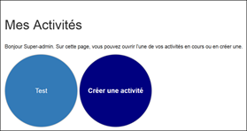
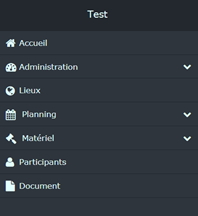

# Travail-cfc
Travail de fin de CFC réalisé au CPNV

## **Description** 

Le travail consiste à développer un site web permettant de planifier des activités. Les personnes visées par ce produit sont par exemple les chefs scouts lorsqu’ils doivent organiser des camps ou des sorties.

 

## **Logiciels**

·     Notepad++

·     Pencil (maquette)

·     WAMP server 64

o     Apache version : 2.4.9

o     Php version : 5.5.12

·     Bootstrap pour le design du site (CSS)

·     Firefox (53.0.3/32 bits) et Google Chrome (58.0.3029.110 / 64-bit) pour tester le site 

## **Objectifs** 

·     Création de comptes utilisateurs et authentification

·     Création d’activités, entité principale gérée par le site. 

Pour chaque activité, l’utilisateur doit pouvoir gérer (Ajout/modification/suppression) :

o     un groupe de travail (autorisation sur l’activité) : utilisateurs habilités à gérer l’activité sur le site web

o     des participants (personnes non inscrites sur le site)

o     des lieux

o     un planning 

o     la liste du matériel nécessaire

o     Pouvoir mettre en ligne des documents (pdf, image, etc.), par exemple des circulaires.

 

## Maquettes 

​                               

Figure 1 : Page pour gérer les activités

 

Figure 2 : Menu de navigation qui apparait après avoir sélectionné/crée une activité.

 

## **Déroulement**

J’ai tout d’abord commencé par analyser la base de données (MCD). La table centrale est la table contenant les informations de l’activité (nom et description). De là découle la structure et les pages du site (voir les deux figures plus haut). Puis j’ai fait des maquettes, un schéma de navigation car il y a beaucoup de pages sur le site. Afin qu’il y ait différents niveau de droits sur une activité pour les utilisateurs, j’ai réalisé également une liste des différents rôles existants.

 

## **Conclusion** 

Pour conclure, le site facilite la vie des organisateurs en leur donnant un outil de gestion pour eux et leur équipe, accessible en ligne depuis n’importe quel appareil.